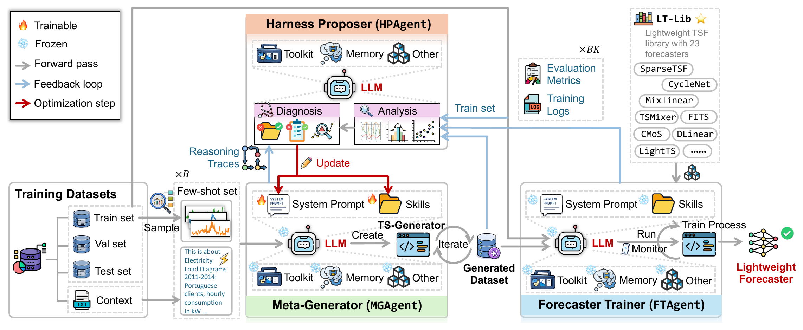
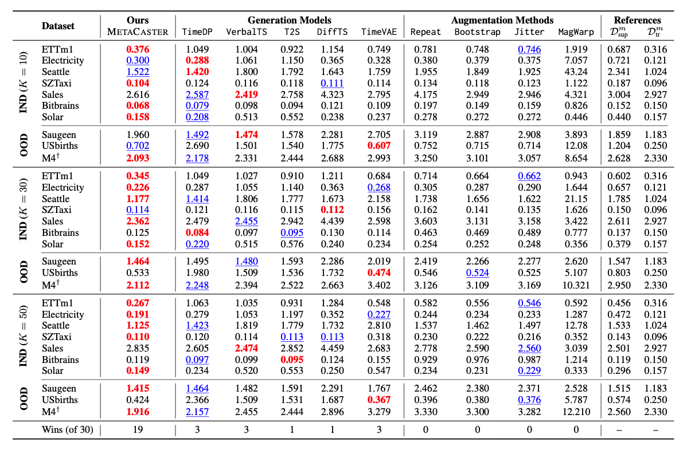

<div align="center">

# (EMNLP2026) MetaCaster: Meta-Harness-Optimized Agent for End-to-End Few-Shot Learning of Lightweight Time Series Forecasters

](https://arxiv.org/abs/2608.23473)


[English](README.md) | [简体中文](README.zh-CN.md)

🔍 [项目简介](#about) · 🧩 [方法框架](#framework) · 🚀 [快速开始](#quick-start) · 📊 [实验结果](#results) · 🔗 [引用](#citation)

</div>

<a id="about"></a>

## 🔍 项目简介

MetaCaster 是一个面向少样本时间序列预测的多智能体框架。它不直接让大语言模型承担预测任务，而是使用 Agent 生成任务自适应训练数据，并训练紧凑、任务专用的 Forecaster 用于下游部署。

### 🔑 核心特性

- **少样本轻量 Forecaster 学习：** MetaCaster 聚焦数据稀缺条件下的轻量 Forecaster 学习，仅根据少量时间序列样本和文本上下文，端到端训练任务专用、可部署的预测模型。
- **Meta-Harness 优化的多智能体框架：** Agent 不直接承担预测，而是作为中间工程师协作完成模型开发；HPAgent 面向下游预测质量优化 MGAgent 的 Harness，MGAgent 生成任务自适应训练数据，FTAgent 训练并选择最优轻量 Forecaster。
- **统一的轻量预测模型库：** LT-Lib 汇集 23 个 2022–2026 年的 SOTA 轻量 Forecaster，提供统一的配置、训练和评估接口，支持跨架构模型开发与选择。
- **高质量且高效的预测：** 在 18 个数据集、23 个轻量 Forecaster 和 14 个 baseline 上的实验验证了 MetaCaster 的有效性；部署后仅保留选中的轻量 Forecaster，推理路径不再依赖 Agent 或 LLM。

<a id="framework"></a>
## 🧩 方法框架

<div align="center">

| [](docs/assets/framework.png) |
|:--:|
| **图 1.** MetaCaster 的 Harness Optimization 框架。 |

</div>

MetaCaster 提供统一入口，依次运行 MGAgent 和 FTAgent：

```bash
python -m agents.metacaster
```

系统包含三个 Agent：

| 组件 | 功能 | 入口 |
|---|---|---|
| **MGAgent** | 使用训练后的 Harness 生成任务自适应训练窗口 | `python -m agents.mgagent.agent` |
| **FTAgent** | 并行训练 LT-Lib Forecaster，并按验证集 MSE 选择 Top-1 | `python -m agents.ftagent.agent` |
| **HPAgent** | 通过 LT-Lib Forecaster 优化 MGAgent Harness | `python -m agents.hpagent.agent` |

仓库已经包含最终训练得到的 Harness。只有需要从头训练新 Harness 时才运行 HPAgent。

<a id="quick-start"></a>
## 🚀 快速开始

需要 Python 3.12、[`uv`](https://docs.astral.sh/uv/)、LLM 服务密钥和用于训练 Forecaster 的 CUDA GPU。首先在发布目录根路径完成环境与数据准备：

```bash
uv sync
uv sync --project lt_lib
cp .env.example .env  # 填写模型、API key 和数据路径
uv run python scripts/download_gift_eval.py --all
uv run python scripts/prepare_gift_eval.py --all

DATASET="your-dataset-name"
INPUT_DIR="data/GIFT-Eval/test/${DATASET}/agent_view_k30"
TEST_FILE="data/GIFT-Eval/test/${DATASET}/test.npy"
```

### 1. 完整使用：生成数据并训练下游 Forecaster

```bash
uv run python -m agents.metacaster \
  --input-dir "$INPUT_DIR" \
  --test "$TEST_FILE" \
  --gpus 0,1,2,3 \
  --tune \
  --output work_dir/metacaster
```

MGAgent 输出保存在 `work_dir/metacaster/generated/`，选中的模型、配置和训练结果保存在 `work_dir/metacaster/forecaster/`。默认训练 20 个主 Forecaster；使用 `--all-models` 可训练全部 23 个 Forecaster，也可通过 `--models` 指定模型。

### 2. 单独生成数据

```bash
uv run python -m agents.mgagent.agent \
  --input-dir "$INPUT_DIR" \
  --output work_dir/generated \
  "Generate task-adaptive training windows"
```

生成结果为 `work_dir/generated/dataset.npy`，验证报告为 `work_dir/generated/validation_report.json`。

### 3. 单独训练下游 Forecaster

```bash
uv run --project lt_lib python -m agents.ftagent.agent \
  --synthetic /path/to/dataset.npy \
  --input-dir "$INPUT_DIR" \
  --test "$TEST_FILE" \
  --gpus 0,1,2,3 \
  --main-only \
  --tune \
  --output work_dir/forecaster
```

移除 `--main-only` 可训练全部 23 个 Forecaster，也可通过 `--models` 指定模型。使用 `agents.ftagent.predict` 可直接运行选中的模型，详见 [`lt_lib/README.md`](lt_lib/README.md)。

### 4. 从头训练新 Harness

```bash
uv run python -m agents.hpagent.agent \
  --gpus 0,1,2,3
```

HPAgent 会迭代优化 MGAgent 的 Harness，并将运行结果写入 `work_dir/runs/`。

## 📁 仓库结构

```text
agents/                MetaCaster 统一入口及各 Agent 独立入口
generation/            MGAgent 运行时
harness/               最终训练得到的 router 和 generation skill
optimizer/             Harness Optimization 运行时
lt_lib/    LT-Lib：23 个 Forecaster 及训练运行时
scripts/               GIFT-Eval 数据准备
eval/                  生成质量评估
docs/assets/           框架图和实验结果图
```

LT-Lib 的安装和模型验证方式请参阅 [`lt_lib/README.md`](lt_lib/README.md)。

<a id="results"></a>
## 📊 实验结果

<div align="center">

| [](docs/assets/results.png) |
|:--:|
| **图 2.** MetaCaster 在 $K=10、30、50$ 的 IND 和 OOD 任务上的预测 MSE；在 30 个数据集–shot 设置中取得 19 个最优结果。 |

</div>

<a id="citation"></a>

## 🔗 引用

```bibtex
@inproceedings{shen2026metacaster,
  title     = {MetaCaster: Meta-Harness-Optimized Agent for End-to-End Few-Shot Learning of Lightweight Time Series Forecasters},
  author    = {Shen, ChengAo and Yu, Wenchao and Wu, Fangyu and Song, Dongjin and Tong, Hanghang and Luo, Dongsheng and Cheng, Wei and Chen, Haifeng and Ni, Jingchao},
  booktitle = {Proceedings of the 2026 Conference on Empirical Methods in Natural Language Processing},
  year      = {2026}
}
```

## 📧 联系方式

如有任何问题或疑问，请联系：cshen9 [at] uh [dot] edu，或在本仓库提交 Issue。
